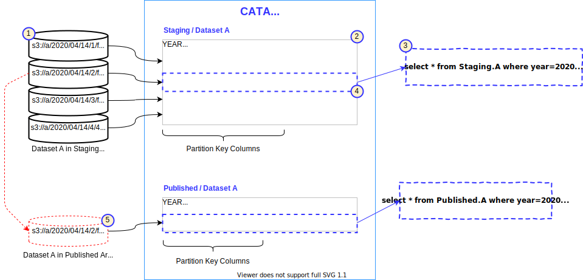
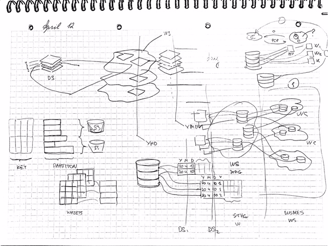

Light Data Lake Thoughts

Have a datasets catalog under your full control? Here is what you can do with it.

Over this long weekend, I have been doing some design for a data platform which hosts datasets and has a custom built catalog. 
The catalog is accessible for the users that can do some data analytics via various tools. 
I was trying to find a way for how to expose a partitioned dataset in the catalog for the users who want to query 
data over some period of time. The problem was with data versions in the dataset - for each processing day the data could 
arrive many times and only one version of it would be interesting for those trending queries. 
Sure, it is not a big problem - we can say that only the latest version should be used or have another dataset with the versions that are deemed
to be published, but I wanted to find more simple solution. And as it usually can be - the solution manifests itself 
if you can focus out from the problem and consider different approaches.

Let me show how it can be solved in the example below:

The dataset A (1) is hosted in some S3 bucket, and on 14th of April four versions of data 
have arrived. The datasets catalog has registered the dataset partitions (2). Then, a user writes a query (3) and fires it 
into the platform. The platform extracts the query criteria and performs partitions pruning via the catalog (4) - 
the partitions scan has only one partition to be processed. Nothing is unusual so far. You can imagine all possible 
tricks the user shall do with versions in queries to see the trending data across the year. Not simple...

Now imagine that your platform has two data areas: the staging area where all versions of data are accumulated and the publishing area 
where only one version of the data is allowed. The publishing mechanism can be implemented within the catalog - we can create a 
virtual dataset by pointing its partition to the file (5) associated with the version that is being published. No data 
needs to be copied - we link the same file to the new dataset. The fact that the published dataset has only one partition 
per a day makes all the possible trending queries on it very simple. Easy? I believe yes. 

To sum up: If you can generate entries into your catalog and fabricate partitions in a form you need, if you can set up
business processes around your data so that only one version is selected to be final, you can extremely simplify life of 
you data analysts who would not be forced anymore to deal with technical versions and can focus on others more interesting 
 aspects of data analysis. 
 
P.S. Just make it bit less abstract: in our set up we are using Apache Spark with custom DataSource over some S3 compatible store. 

P.S.1 Some original drawing where I have another idea to explore: Workspaces in the areas that can actually grab datasets versions
per the processing logic specific to that... something to be published soon.

